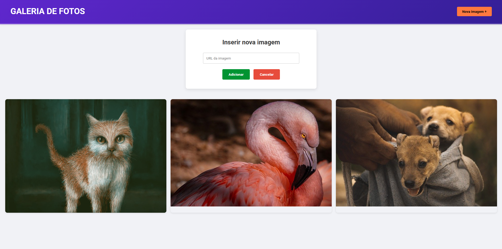

# Galeria de Fotos com jQuery

[🇧🇷 Versão em Português](#-versão-em-português) | [🇺🇸 English Version](#-english-version)

---


Uma simples galeria para armazenamento de imagens

### 📋 Índice
- [📌 Sobre o Projeto](#-sobre-o-projeto)
- [🚀 Tecnologias Utilizadas](#-tecnologias-utilizadas)
- [💻 Como Executar](#-como-executar)
- [📷 Funcionalidades](#-funcionalidades)
- [📬 Contato](#-contato)
- [📜 Licença](#-licença)

---

## 📌 Sobre o Projeto
Galeria de Fotos com jQuery é uma aplicação web que permite exibir e gerenciar uma galeria de imagens. Com ela, o usuário pode visualizar fotos e inserir novas imagens através de um formulário interativo.

### 🔹 Funcionalidades Principais:
- Exibir uma galeria de fotos.
- Adicionar novas imagens à galeria por meio de um formulário.
- Visualizar imagens em tamanho real com um overlay interativo.

---

## 🚀 Tecnologias Utilizadas
- **HTML5**
- **CSS3**
- **jQuery** (3.7.1)
- **Google Fonts** (Roboto)

---

## 💻 Como Executar
1️⃣ Clone o repositório:
```bash
git clone https://github.com/seu-usuario/galeria-de-fotos-jquery.git
```
2️⃣ Acesse a pasta do projeto:
```bash
cd galeria-de-fotos-jquery
```
3️⃣ Abra o arquivo `index.html` no navegador.

> 📌 **Dica:** Utilize o **Live Server** no VSCode para uma melhor experiência.

---

## 📷 Funcionalidades
### ✏️ Adicionar Nova Imagem
- Clique no botão "Nova imagem +" no cabeçalho para exibir o formulário.
- Insira a URL da nova imagem e clique em "Adicionar" para incluí-la na galeria.
- Utilize o botão "Cancelar" para fechar o formulário sem adicionar a imagem.

### 🔍 Visualizar Imagem em Tamanho Real
- Passe o mouse sobre a imagem para exibir um overlay com um link.
- Clique no link para abrir a imagem em tamanho real em uma nova aba.

---

## 📬 Contato
📧 **E-mail:** gabrielcamarate@icloud.com  
🌐 **Redes Sociais:** [LinkedIn](#) | [GitHub](#)

---

## 📜 Licença
Este projeto foi desenvolvido para fins educacionais e não possui licença comercial.

---

📝 **Desenvolvido com jQuery e CSS**
